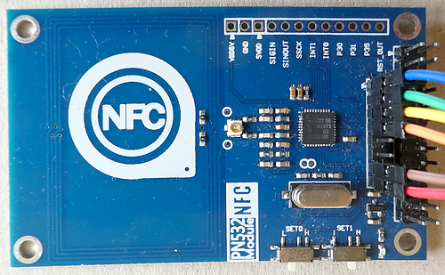
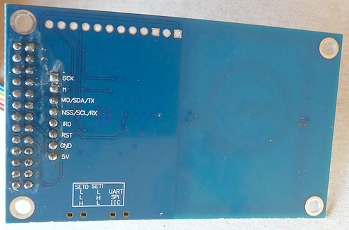
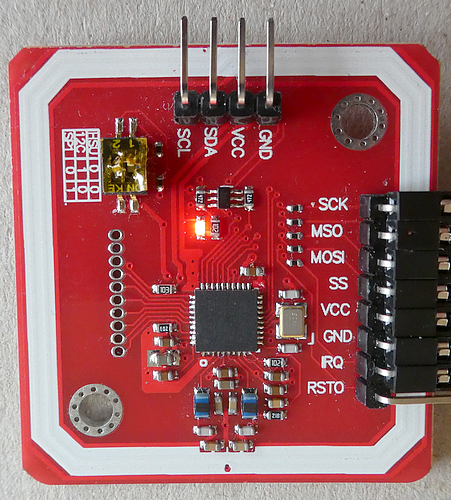
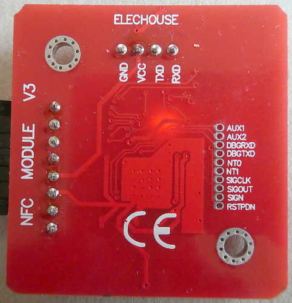
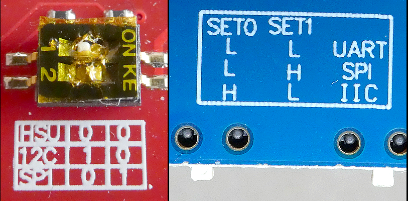

# ESP32 Adafruit PN532 Read a Credit Card
The tutorial explains how to read a Credit Card on an ESP32 with a connected PN5232 NFC reader.

This is the accompanying repository for my article "Read an EMV (Credit-) card with your ESP32 and PN532 NFC Reader" available here:


## Important notes about the code
Please note: The sketch is just the tutorial code and does not contain any code for displaying any data on a TFT display ! 

The DESFire library contains just the code (commands) needed for the tutorial but not a full implementation of the DESFire EVx commands.

## Required Hardware (NFC Reader)

I'm recommending two NFC readers, but please be aware that I read some negative comments on the "Red" PCB one - some seem to have design flaws.

 

 

### SPI interface

To use the **SPI mode** you have to bring the switch in the right position:



````plaintext
// settings for ESP32 ST7789 1.9-inches TFT display
#define PN532_SCK (33)
#define PN532_MOSI (32)
#define PN532_SS (25)
#define PN532_MISO (34)
#define PN532_IRQ (-1)   // not connected
#define PN532_RESET (-1) // not connected
// The VCC pin of the reader is connected to the 3.3V pin of the ESP32
````

````plaintext
// settings for ESP32-S3 Developmentboard with TFT Display
#define PN532_SCK (42)
#define PN532_MOSI (2)
#define PN532_SS (40)
#define PN532_MISO (41)
#define PN532_IRQ (-1)   // not connected
#define PN532_RESET (-1) // not connected
// The VCC pin of the reader is connected to the 3.3V pin of the ESP32
````

## Required Library
````plaintext
Adafruit_PN532 by Adafruit version 1.3.4 (https://github.com/adafruit/Adafruit-PN532)
````

## Documents

### NTAG424DNA documents
data sheet Rev. 3.0 — 31 January 2019: https://www.nxp.com/docs/en/data-sheet/NT4H2421Gx.pdf (NT4H2421Gx_NTAG_424_DNA_data_sheet_rev_3_0_2019_01_31.pdf)

Features and Hints Application note Rev. 2.0 — 4 March 2025: https://www.nxp.com/docs/en/application-note/AN12196.pdf (AN12196_NTAG424_Features_and_Hints_Rev_2_0_2025_03_04.pdf)

### Mifare DESFire Light documents

data sheet Rev. 3.3 — 5 April 2019: https://www.nxp.com/docs/en/data-sheet/MF2DLHX0.pdf (MF2DLHX0_MIFARE_DESFire_Light_data_sheet_rev_3_3_2019_04_05.pdf)

Features and Hints Application note Rev. 1.1 — 20 January 2020: https://www.nxp.com/docs/en/application-note/AN12343.pdf (AN12343_MIFARE_DESFire_Light_Features_and_Hints_Rev_1_1_2020_01_20.pdf)

### Mifare DESFire EV3 Short data sheet

Short data sheet Rev. 3.1 — 11 January 2024: https://www.nxp.com/docs/en/data-sheet/MF3D_H_X3_SDS.pdf (MF3D_H_X3_SDS_MIFARE_DESFire_EV3_short_data_sheet_Rev_3_1_2024_01_11.pdf)

### Additional documents

Mifare DESFire protocol: https://raw.githubusercontent.com/revk/DESFireAES/master/DESFire.pdf (NXP_MIFARE_DESFire_EV1_Protocol.pdf)

### AN12752_MIFARE_DESFire_EV3_feature_and_functionality_comparison

MIFARE DESFire EV3 feature and functionality comparison to other MIFARE DESFire products Rev. 1.4 — 24 July 2023: https://www.nxp.com/docs/en/application-note/AN12752.pdf (AN12752_MIFARE_DESFire_EV3_feature_and_functionality_comparison_Rev_1_4_2023_07_24.pdf)

## Development Environment
````plaintext
Arduino IDE Version 2.3.6 (Windows)
arduino-esp32 boards Version 3.2.0 (https://github.com/espressif/arduino-esp32)
````

## Implementations


## Log file of the complete tutorial workflow
````plaintext
ESP32 Adafruit PN532 DESFire Starter V02

````


